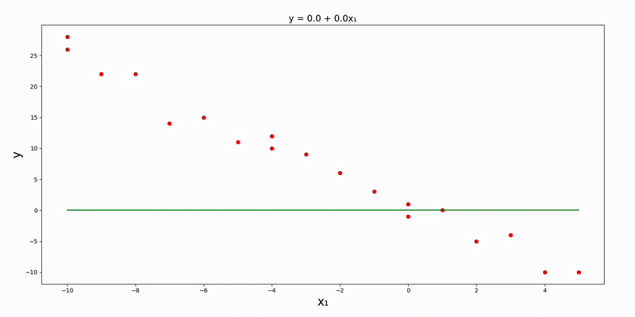
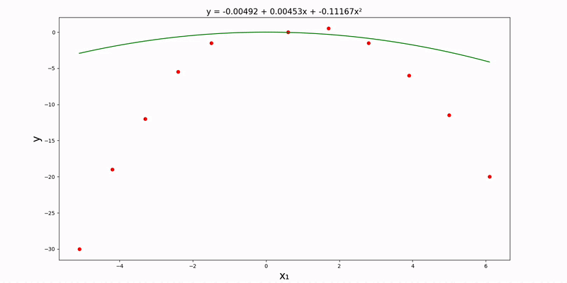
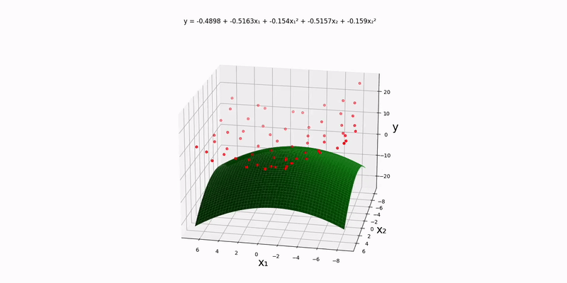
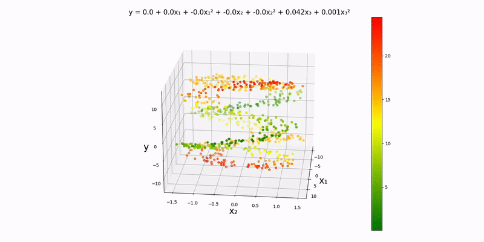
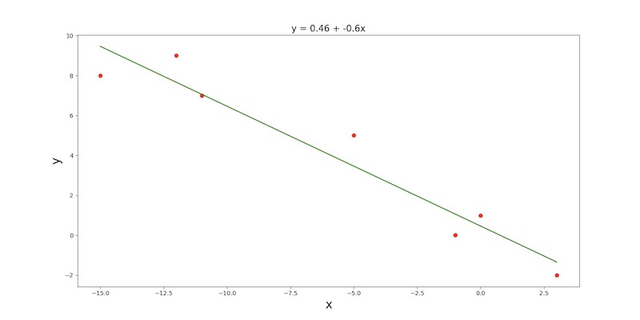
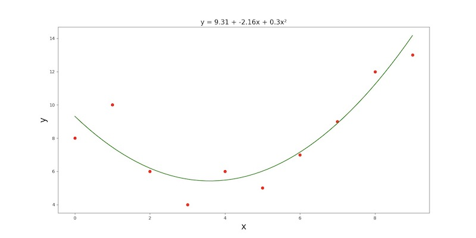
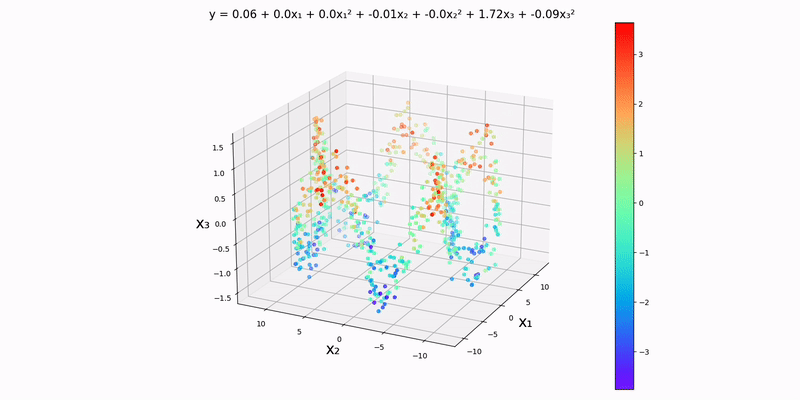

<div align="center">

    <h1>
       Machine Learning Models
    </h1>
    <p>
        This repo contains a variety of machine learning models built from scratch (using just pure mathematics & without any built-in machine learning capabilities from libraries). All of the models were built using <strong>Python</strong> + <strong>Numpy</strong> + math and visualized with <strong>Matplotlib</strong>. This repo also includes a full explanation behind the mathematics of each model along with how to use each script.
    </p>
</div>

## Included Models

* [(Gradient Descent) Uni/Multi-Variate Linear Regression](#gradient-descent-unimulti-variate-linear-regression)
* [(Gradient Descent) Uni/Multi-Variate Quadratic Regression](#gradient-descent-unimulti-variate-quadratic-regression)
* [(Normal Equation) Uni/Multi-Variate Linear Regression](#normal-equation-unimulti-variate-linear-regression)
* [(Normal Equation) Uni/Multi-Variate Quadratic Regression](#normal-equation-unimulti-variate-quadratic-regression)
* Currently working on **Univariate Sinusoidal Regressions**, **Logistic Regressions**, & **Neural Networks**. Repo will be updated once those are finalized!

## Notes
* Python 3.10+ w/ Tkinter is required.
* Make sure all dependencies are installed before running any of the scripts.
  * `pip3 install -r requirements.txt`
* Prerequisite knowledge (to understand the mathematics behind each model):
  * Multivariable calculus.
  * Linear algebra.
* All inputs will be CSV files that meet the following requirements:
  * All rows have the same number of columns.
  * Contains only numeric values.
  * Values are separated by commas.
  * No trailing commas.
  * Has at least two lines.
  * The last line contains the y-values.
  * All previous lines contain the x-values.

## (Gradient Descent) Uni/Multi-Variate Linear Regression

Let's briefly cover some standard notation:
* $\vec{x}$: input vector (feature).
* $\vec{y}$: output vector (label).
* $\hat{y}$: predicted output.
* $m$: number of training examples.
* $n$: number of input variables.
* $(x^{(i)}, y^{(i)})$: $i^{th}$ training example.

**Univariate case**: let's say we have the following table of experimental data:

|   x   |   y   |
| :---: | :---: |
|  -10  |  26   |
|  -10  |  28   |
|  -9   |  22   |
|  -8   |  22   |
|  -7   |  14   |
|  -6   |  15   |
|  -5   |  11   |
|  -4   |  12   |
|  -4   |  10   |
|  -3   |   9   |
|  -2   |   6   |
|  -1   |   3   |
|   0   |  -1   |
|   0   |   1   |
|   1   |  -0   |
|   2   |  -5   |
|   3   |  -4   |
|   4   |  -10  |
|   5   |  -10  |

Our goal is to predict how $x$ and $y$ are correlated. Suppose each $y_i$ can be predicted by some function of each $x_i$. The standard notation for said function is $f_{w,b}(x) = wx+b$. For ease of calculations, let $\vec{\beta} = [w, b]$ be our **parameter vector** and $X$ be a **design matrix** with $n+1$ columns. The left-most column should contain all ones while the other columns should contain the entries of our input. We can rewrite our function like $f_{\vec{\beta}}(X) = X\vec{\beta}$, so it is more streamlined. If we initialize $w, b = 0$, we would unsurprisingly get a terrible output. We can measure how bad this output is by using the following **cost function** (both scalar and vector/matrix versions are displayed):

```math
\begin{align}
J(w, b) &= \frac{1}{2m} \sum_{1 \le i \le m} (f_{w, b}(x^{(i)}) - y^{(i)})^2 \\
J(\vec{\beta}) &= \frac{1}{2m} (f_{\vec{\beta}}(X) - \vec{y}) \cdot (f_{\vec{\beta}}(X) - \vec{y})
\end{align}
```

We want to continually adjust our weights, so that our cost decreases over time. In order to do this, we must calculate how much each weight is contributing towards the cost (this is called the gradient). This is given by the following partial derivatives (given in scalar and vector/matrix versions):

```math
\begin{align}
\frac{\partial}{\partial w} J(w, b) &= \frac{1}{m} \sum_{1 \le i \le m} (f_{w, b}(x^{(i)}) - y^{(i)})x^{(i)} \\
\frac{\partial}{\partial b} J(w, b) &= \frac{1}{m} \sum_{1 \le i \le m} (f_{w, b}(x^{(i)}) - y^{(i)}) \\
\frac{\partial}{\partial \vec{\beta_k}} J(\vec{\beta}) &= \frac{1}{m} \sum_{1 \le i \le m} (f_{\vec{\beta}}(X) - \vec{y}) \vec{x_k}
\end{align}
```

Now all we need to do is repeat the following operations until our algorithm converges (again, both scalar and matrix versions):

```math
\begin{align}
w &:= w - \alpha \frac{\partial}{\partial w} J(w, b) \\
b &:= b - \alpha \frac{\partial}{\partial b} J(w, b) \\
\beta_k &:= \beta_k - \alpha \frac{\partial}{\partial \beta_k} J(\vec{\beta})
\end{align}
```

Note that these updates must be done simultaneously. Also, $\alpha$ is called the **learning rate**. This is usually set to a small value (like $10^{-6}$). It is just to make sure that our algorithm doesn't diverge. Now let's go ahead and look at a demo of things! First thigns first, we need to convert our data into CSV format (this can be found at `src/data/gradient/linear/univariate.csv`):

```csv
-10, -10, -9, -8, -7, -6, -5, -4, -4, -3, -2, -1,  0, 0, 1,  2,  3,   4,   5
 26,  28, 22, 22, 14, 15, 11, 12, 10,  9,  6,  3, -1, 1, 0, -5, -4, -10, -10
```

Navigate to the `src` directory and find the `config.json` file. Make the following changes if necessary:

```json
{
    "regression_method": "gradient",
    "regression_type": "linear",
    "input_file_path": "data/normal/linear/univariate.csv"
}
```

The `parameter_precision` key can be optionally modified (in this example, it's set to `4`). After running `main.py`, we can see the plot of our data along with the linear regression line:



**Bivariate case**: the math works out similarly with two inputs as well. Let's try to see how the experimental data found in `src/data/linear/bivariate` can be modeled. We'll need to slightly modify our `config.json` file beforehand:

```json
{
    "regression_method": "gradient",
    "regression_type": "linear",
    "input_file_path": "data/normal/linear/bivariate.csv"
}
```

Running `main.py` yields:


**Trivariate case**: modify `config.json` so that it matches the following:

```json
{
    "regression_method": "gradient",
    "regression_type": "linear",
    "input_file_path": "data/normal/linear/trivariate.csv"
}
```

Run `main.py` to visualize:


This is basically a contour map but in one higher dimension. The colors represent how bad our prediction is. Over time, we can see that everything slowly starts turning green as our weights improve. Note that there is one tiny datapoint that stays stagnant throughout; this is purposefully done, so we can see how the colors change as training progresses.

**Multivariate with more than 3 inputs**: visualization will be near impossible. The script will continually produce multiple outputs similar to like this instead:

```
y = 20.0 + 16.96(x_1) + 20.58(x_2) + 16.96(x_3) + 20.58(x_4)
```

## (Gradient Descent) Uni/Multi-Variate Quadratic Regression

Quadratic regressions are very similar to linear regressions.

**Univariate case**: use following parameter vector and design matrix (hypothesis function stays the same):

```math

\vec{\beta} = \begin{bmatrix}
\beta_0 \\
\beta_1 \\
\beta_2 \\
\end{bmatrix}

,

X = \begin{bmatrix}
     1 &    x^{(1)} &  (x^{(1)})^2 \\
     1 &    x^{(2)} &  (x^{(2)})^2 \\
\vdots &     \vdots &       \vdots \\
     1 &    x^{(n)} &  (x^{(n)})^2 \\
\end{bmatrix}
```

The math magically works out because of the way we used vectors/matrices to set things up. Let's use the following configurations for our `config.json` file:

```json
{
    "regression_method": "gradient",
    "regression_type": "quadratic",
    "input_file_path": "data/gradient/quadratic/univariate.csv",
}
```

Running `script.py` outputs:



**Bivariate case**: similar to the univariate case, we can set things up for the bivariate case like so:

```math

\vec{\beta} = \begin{bmatrix}
\beta_0 \\
\beta_1 \\
\beta_2 \\
\beta_3 \\
\beta_4 \\
\end{bmatrix}

,

X = \begin{bmatrix}
     1 & x_1^{(1)} & (x_1^{(1)})^2 & x_2^{(1)} & (x_2^{(1)})^2 \\
     1 & x_1^{(2)} & (x_1^{(2)})^2 & x_2^{(2)} & (x_2^{(2)})^2 \\
\vdots &    \vdots &        \vdots &    \vdots &        \vdots \\
     1 & x_1^{(m)} & (x_1^{(m)})^2 & x_2^{(m)} & (x_2^{(m)})^2 \\
\end{bmatrix}
```

Setting up `config.json`:

```json
{
    "regression_method": "gradient",
    "regression_type": "quadratic",
    "input_file_path": "data/gradient/quadratic/bivariate.csv",
}
```

Running `script.py`:



**Trivariate case**: hopefully we can spot the pattern for how to set up the parameter vector and design matrix by now:

```math

\vec{\beta} = \begin{bmatrix}
\beta_0 \\
\beta_1 \\
\beta_2 \\
\beta_3 \\
\beta_4 \\
\beta_5 \\
\beta_6 \\
\end{bmatrix}

,

X = \begin{bmatrix}
     1 & x_1^{(1)} & (x_1^{(1)})^2 & x_2^{(1)} & (x_2^{(1)})^2 & x_3^{(1)} & (x_3^{(1)})^2 \\
     1 & x_1^{(2)} & (x_1^{(2)})^2 & x_2^{(2)} & (x_2^{(2)})^2 & x_3^{(2)} & (x_3^{(2)})^2 \\
\vdots &    \vdots &        \vdots &    \vdots &        \vdots &    \vdots &        \vdots \\
     1 & x_1^{(m)} & (x_1^{(m)})^2 & x_2^{(m)} & (x_2^{(m)})^2 & x_3^{(m)} & (x_3^{(m)})^2 \\
\end{bmatrix}
```

Setting up `config.json`:

```json
{
    "regression_method": "gradient",
    "regression_type": "quadratic",
    "input_file_path": "data/gradient/quadratic/trivariate.csv",
}
```

Running `script.py`:




Like with the trivariate linear regression, I should mention that this is essentially a contour map in one higher dimension with the colors representing how bad our prediction is. The dots slowly turn green as training progresses. And again, there is one tiny datapoint that stays stagnant throughout; this is purposefully done, so we can see how the colors change over time.

**Multivariate with more than 3 inputs**: visualization will be difficult. Instead, the script will continually produce multiple outputs similar to like this:

```
y = 0.0 + 0.0(x_1) + 0.0(x_1)² + -0.0(x_2) + 0.0(x_2)² + 0.3901(x_3) + 0.017(x_3)² + 0.7933(x_4) + -0.0042(x_4)²
```

## (Normal Equation) Uni/Multi-Variate Linear Regression

**Univariate case**: after exploring a single-variable regression first, we'll have a look at multi-variable regressions afterwards. Let's say we have the following experimental data, and we want to find the line of best fit to make predictions for other inputs.

|   x   |   y   |
| :---: | :---: |
|  -15  |   8   |
|  -12  |   9   |
|  -11  |   7   |
|  -5   |   5   |
|  -1   |   0   |
|   0   |   1   |
|   3   |  -2   |

Suppose each $y_i$ can be predicted by some function of each $x_i$. Since we are doing a linear regression, a natural choice would be $y(x) = \beta_0 + \beta_1x$, where our predictor function is parameterized by $\beta_0$ & $\beta_1$. Let $\hat{y_i} = y(x_i)$. We want to find $\beta_0, \beta_1 \in \mathbb{R}$ such that the sum of the squares of the residuals, $\sum_i (y_i-\hat{y_i})^2$, is minimized. In order to do this, we will construct a **parameter vector**; an **observation vector** that contains all of our observed outputs; and a **design matrix**, where second column of the design matrix takes on the values of our inputs:

```math
\vec{\beta} = \begin{bmatrix}
\beta_0 \\
\beta_1 \\
\end{bmatrix}

,

\vec{y} = \begin{bmatrix}
 8 \\
 9 \\
 7 \\
 5 \\
 0 \\
 1 \\
-2 \\
\end{bmatrix}

,

X = \begin{bmatrix}
1 & -15 \\
1 & -12 \\
1 & -11 \\
1 &  -5 \\
1 &  -1 \\
1 &   0 \\
1 &   3 \\
\end{bmatrix}
```

Let $\hat{y}$ be the projection of $\vec{y}$ onto the column space of $X$. $\hat{y}$ is the closest vector to $\vec{y}$ that lies on $\textrm{Col }X$. That way, we can assume $\hat{y} = X\vec{\beta}$ has a solution. Finding a solution, $\vec{\beta}$, to $\hat{y} = X\vec{\beta}$ yields a $\|\| \vec{y}-X\vec{\beta} \|\|$ that is as small as possible. Since $\vec{y} - \hat{y}$ is orthogonal to $\textrm{Col }X$, $\vec{y} - X\vec{\beta}$ is orthogonal to each column of $X$. Therefore, taking the dot proudct of any column of $X$ and $\vec{y} - X\vec{\beta}$ equals $0$. So,

```math
\begin{align}
X^T(\vec{y} - X\vec{\beta}) &= 0 \\
X^T\vec{y} - X^TX\vec{\beta} &= 0 \\
X^TX\vec{\beta} &= X^T\vec{y} \\ 
\vec{\beta} &= (X^TX)^{-1}X^T\vec{y }\\
\end{align}
```

The third line is called the **normal equation**. Calculating $(X^TX)^{-1}$ and multipying it with $X^T\vec{y}$ gives us our desired solution (if $X^TX$ is noninvertible, we can use the **Moore-Penrose Pseudoinverse**). Now let's see it in action! First, let's transpose our table and convert it into CSV format (this is given in `src/data/normal/linear/univariate.csv`):

```csv
-15, -12, -11, -5, -1, 0,  3
  8,   9,   7,  5,  0, 1, -2
```

Next, navigate to the `src` directory, and find the `config.json` file. Make sure the value of `regression_method` on line 2 is set to `"normal"`, `regression_type` on line 3 is set to `"linear"`, and `input_file_path` on line 3 is set to `"data/normal/linear/univariate.csv"`. We may optionally modify `parameter_precision` on line 5 to change the amount of decimals our $\vec{\beta}$ vector is rounded to. After running `main.py`, the output should look something like this:



**Bivariate case**: our design matrix's left-most column should still contain all ones, but this time, the subsequent columns should contain the input data points. Notice that $\hat{y} = \beta_0 + \sum_{1 \le i \le n} \beta_i x_i = X\hat{\beta}$ (where $n$ is the number of input variables). The prcoess to solve is the exact same as in the single variable case. Below is some arbitrary experimental data along its conversion into the correct CSV format (`src/data/normal/linear/bivariate.csv`):

|  x₁   |  x₂   |   y   |
| :---: | :---: | :---: |
|  -6   |   6   |  12   |
|   0   |   5   |   4   |
|   1   |   3   |   7   |
|   2   |   4   |   3   |
|   4   |   2   |  -2   |
|   5   |  -1   |  -4   |
|   7   |  -4   |  -6   |
|  11   |  -4   |  -5   |
|   8   |  -7   |  -4   |
|  12   |  -6   |  -6   |
|   9   |  -10  |  -10  |

```csv
-6,  0, 1, 2,  4,  5,  7, 11,  8, 12,   9
 6,  5, 3, 4,  2, -1, -4, -4, -7, -6, -10
 12, 4, 7, 3, -2, -4, -6, -5, -4, -6, -10
```

The first, second, and third lines represent the data points for $x_1$, $x_2$, and $y$, respectively. Now let's modify our `config.json` file so that `input_file_path` is set to `"src/data/normal/linear/bivariate.csv"`. Running the `main.py` yields the plane of best fit for our dataset:


**Trivariate case**: using `"src/data/normal/linear/trivariate.csv"` as our input file, we can see that a decent approximation for this dataset would be $y = x_1 - x_2$. This can be visualized using an analog of a contour map in one higher dimension:


This makes sense because it seems like the plane $x_1=x_2$ "splits" our datapoints into two regions; one side of the plane contains the upper values for $y$ while the other side contains the lower values for $y$. Of course, it won't always be the case that our y-values will only depend on 2 of the 3 input variables. I specifically generated this dataset, so we could actually see a pattern! If it were to depend on 3 input variables, it would be hard to spot a pattern in the experimental data, and we won't be able to visualize the regression. 

**Multivariate with more than 3 inputs**: this idea can be extended to higher dimensions as well. Although no plot would be generated, the script still produces an output in this format: $\hat{y} = \beta_0 + \sum_{1 \le i \le n} \beta_i x_i$ (where $n$ is the number of input variables). Example with 4 inputs:

```
y = -1.43 + 1.03(x_1) + 0.24(x_2) + 0.39(x_3) + 0.32(x_4)
```

## (Normal Equation) Uni/Multi-Variate Quadratic Regression

With quadratic regressions, the math works out almost identically to linear regressions.

**Univariate case**: $y = \beta_0 + \beta_1x + \beta_2x^2$. Use the normal equation with the following design matrix:

```math
X = \begin{bmatrix}
     1 &    x_1 &  x_1^2 \\
     1 &    x_2 &  x_2^2 \\
\vdots & \vdots & \vdots \\
     1 &    x_n &  x_n^2 \\
\end{bmatrix}
```

Double-cheeck that we're still in the `src` directory. Let's modify `config.json` so that the value of `regression_method` is `"normal"`, `regression_type` is `"quadratic"`, and `input_file_path` is `"data/normal/quadratic/univariate.csv"`. Here is what it looks like:

```csv
0,  1, 2, 3, 4, 5, 6, 7,  8,  9
8, 10, 6, 4, 6, 5, 7, 9, 12, 13
```

After running `main.py`, we get the following plot and quadratic regression equation:



**Bivariate case**: $y = \beta_0 + \beta_1u + \beta_2u^2 +  \beta_1v + \beta_2v^2$. Use the normal equation with the following design matrix:

```math
X = \begin{bmatrix}
     1 &    u_1 &  u_1^2 &    v_1 &  v_1^2 \\
     1 &    u_2 &  u_2^2 &    v_2 &  v_2^2 \\
\vdots & \vdots & \vdots & \vdots & \vdots \\
     1 &    u_n &  u_n^2 &    v_n &  v_n^2 \\
\end{bmatrix}
```

Using the example experimental data in `data/normal/quadratic/bivariate.csv` (and changing `config.json` accordingly), we get the following output:


**Trivariate case**: as you can probably guess, our design matrix will look something like:

```math
X = \begin{bmatrix}
     1 &    u_1 &  u_1^2 &    v_1 &  v_1^2 &    w_1 &  w_1^2 \\
     1 &    u_2 &  u_2^2 &    v_2 &  v_2^2 &    w_2 &  w_2^2 \\
\vdots & \vdots & \vdots & \vdots & \vdots & \vdots & \vdots \\
     1 &    u_n &  u_n^2 &    v_n &  v_n^2 &   w_n  &  w_n^2 \\
\end{bmatrix}
```

Again, we'll be using an analog of a contour map in one higher dimension to visualize this. Using the example datapoints in `data/normal/quadratic/trivariate.csv` (and changing `config.json` accordingly), we get the following output:



Just by looking at the output, the y-values to seem to depend almost exclusively on $x_3$ which makes sense since $x_3$ has the strongest weight in the regression equation. Generally, as $x_3$ increases, so does $y$. Again, it won't always be the case that the y-values only depend on 2 of the 3 input variables. I just happened to generate this dataset, so there could actually be a pattern to spot!

**Polynomial regressions of higher degrees or with more inputs**: the same idea can be applied as long as the design matrix is set up properly and the normal equation is used, but it will be tough to visualize! Here is an output output using 4 input variables:

```
y = 0.06 + 0.01(x_1) + 0.10(x_1)² + -0.27(x_2) + -0.09(x_2)² + -0.84(x_3) + -0.32(x_3)² + 1.08(x_4) + -2.055(x_4)²
```